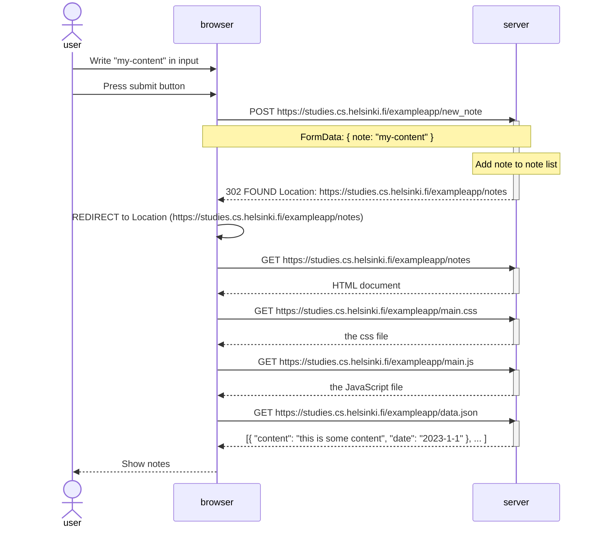

# New note sequence diagram (exercise 0.4)

```mermaid
sequenceDiagram
    actor user
    participant browser
    participant server

    user->>browser: Write "my-content" in input
    user->>browser: Press submit button
    
    browser->>server: POST https://studies.cs.helsinki.fi/exampleapp/new_note
    activate server
    Note over browser,server: FormData: { note: "my-content" }
    Note over server: Add note to note list
    server-->>browser: 302 FOUND Location: https://studies.cs.helsinki.fi/exampleapp/notes
    deactivate server

    browser->>browser: REDIRECT to Location (https://studies.cs.helsinki.fi/exampleapp/notes)

    browser->>server: GET https://studies.cs.helsinki.fi/exampleapp/notes
    activate server
    server-->>browser: HTML document
    deactivate server

    browser->>server: GET https://studies.cs.helsinki.fi/exampleapp/main.css
    activate server
    server-->>browser: the css file
    deactivate server

    browser->>server: GET https://studies.cs.helsinki.fi/exampleapp/main.js
    activate server
    server-->>browser: the JavaScript file
    deactivate server

    browser->>server: GET https://studies.cs.helsinki.fi/exampleapp/data.json
    activate server
    server-->>browser: [{ "content": "this is some content", "date": "2023-1-1" }, ... ]
    deactivate server

    browser-->>user: Show notes
```