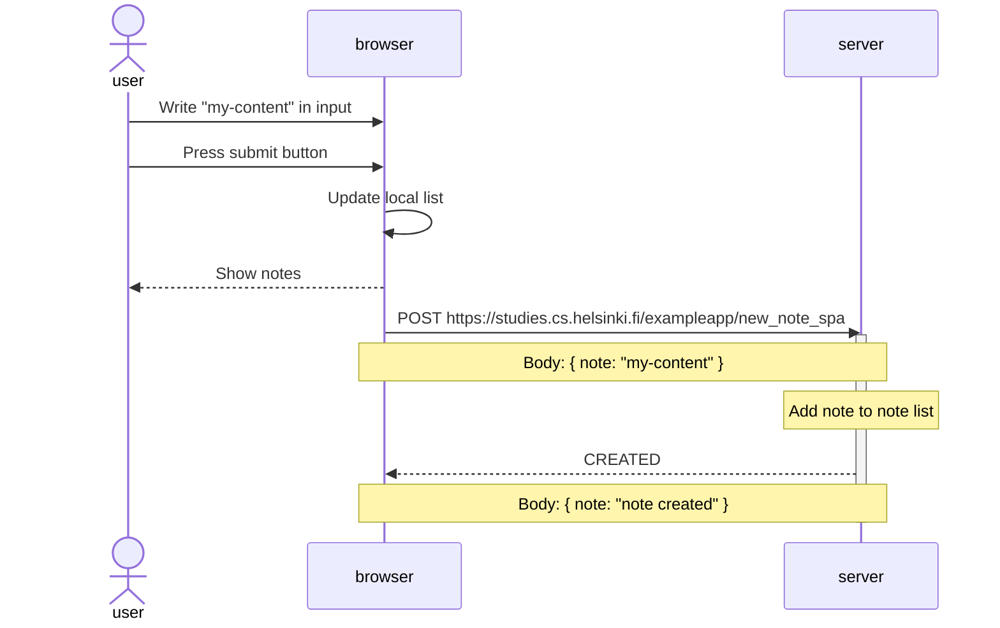

# New note sequence diagram (exercise 0.6)

```mermaid
sequenceDiagram
    actor user
    participant browser
    participant server

    user->>browser: Write "my-content" in input
    user->>browser: Press submit button

    browser->>browser: Update local list
    
    browser-->>user: Show notes

    browser->>server: POST https://studies.cs.helsinki.fi/exampleapp/new_note_spa
    activate server
    Note over browser,server: Body: { note: "my-content" }
    Note over server: Add note to note list
    server-->>browser: CREATED
    Note over browser,server: Body: { note: "note created" }
    deactivate server
```