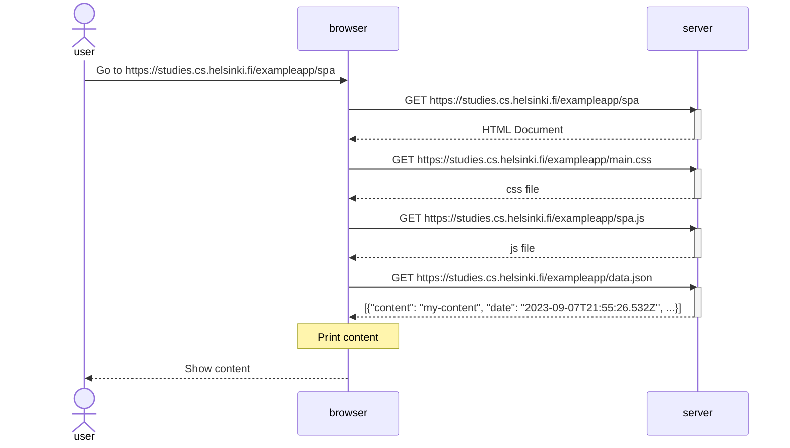

# Single Page Application diagram (exercise 0.5)

```mermaid
sequenceDiagram
    actor user
    participant browser
    participant server

    user->>browser: Go to https://studies.cs.helsinki.fi/exampleapp/spa
    browser->>server: GET https://studies.cs.helsinki.fi/exampleapp/spa
    activate server
    server-->>browser: HTML Document
    deactivate server

    browser->>server: GET https://studies.cs.helsinki.fi/exampleapp/main.css
    activate server
    server-->>browser: css file
    deactivate server

    browser->>server: GET https://studies.cs.helsinki.fi/exampleapp/spa.js
    activate server
    server-->> browser: js file
    deactivate server

    browser->>server: GET https://studies.cs.helsinki.fi/exampleapp/data.json
    activate server
    server-->> browser: [{"content": "my-content", "date": "2023-09-07T21:55:26.532Z", ...}]
    deactivate server

    Note over browser: Print content

    browser-->>user: Show content
```